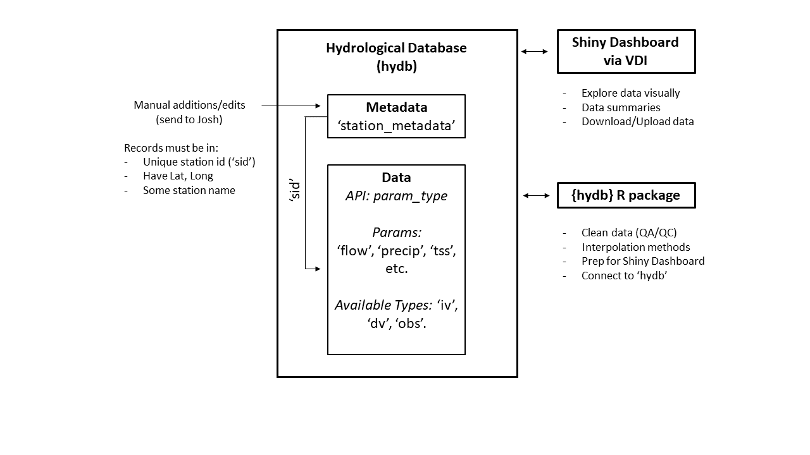
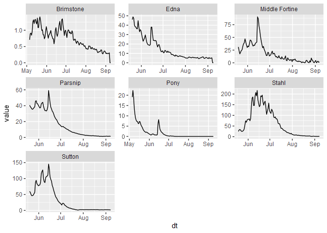

<!-- README.md is generated from README.Rmd. Please edit that file -->

# hydb

<!-- badges: start -->
<!-- badges: end -->

The goal of {hydb} is to provide functions for the cleaning,
manipulating, and testing of hydrological data collected from USDA-USFS
staff and other contributors as well (state, NGO, research). Some of the
functions will be very unique and specific; however, there will be some
basic API functionality for others if they also have sensor/data
cleaning procedures, e.g. transducers, sediment samples, precipitation
cans, etc.

## Installation

You can install the development version of hydb from
[GitHub](https://github.com/) with:

``` r
# install.packages("devtools")
devtools::install_github("joshualerickson/hydb")
```

## Goals

The goal of the {hydb} package is to provide ways of organizing,
testing, and sharing USDA-USFS hydrological data.

## About

The hydrological database (hydb) was created to store hydrology data
collected by USDA-USFS staff from sensors/devices (transducers, precip
cans, ISCOs) and observations (discharge, total suspended sediment,
precipitation) across Region 1. The “hydb” database can currently accept
flow, precipitation and sediment data.

There are several ways to interact with the hydb database:

-   The first requires network privileges through the USDA and using the
    `fetch_hydb()` function.

-   The second is eventually have this open-source through a database
    online (using `fetch_hydb()`).

## Database Design

The database has two main storage ideas: **metadata** `station_metadata`
and **realizations** (all other tables). The schema is similar to how
most relational databases work where each station has a unique id `sid`
and each parameter (`flow, tss, and precipitation`) has a table based on
how it was collected (`dv` = daily, `iv` = instantaneous, and `obs` =
observed). Below is a conceptual framework of the database.



The API for the realizations is separated by an underscore `_` where the
prefix is the realization `precip_` and the suffix is the collection
type `_obs`, e.g. `precip_obs` would be a table in the database.

## Data

When interacting with the database there are some key things to know
about the tables.

-   `precip_*` contains a continuous variable (`value`) of precipitation
    in inches.  
-   `flow_*` contains a continuous variable (`value`) of discharge in
    cubic feet/second (cfs).
-   `tss_*` contains a continuous variable (`value`) of total suspended
    sediment (tss) in mg/l.

In addition, the particular collection type has different definitions.

-   `iv` is an *instantaneous value*. Meaning, the value is collected
    multiple times a day without being aggregated. For example,
    transducer or precipitation sensors will have multiple readings in
    one day. This would be appropriate to put in the `_iv` database
    table.

-   `dv` is a mean *daily value*. This is data aggregated with `_iv`
    data. For example, aggregating multiple transducer readings to one
    day by mean would be appropriate for the `_dv` database table.

-   `obs` is an *observed value*. This is collected by a human
    (discharge, precipitation, tss grab) and then used to interpolate
    measurements when not observed via sensors (in most cases). For
    example, taking a discharge measurement at a site would be an
    observation of discharge. Or, a sample of water would be an
    observation.

## Interacting with hydb

Interacting with the database can involve a couple different methods:
the {hydb} package `fetch_hydb()` function, or using the {DBI} and
{RSQLite} packages. Either way is completely fine! So if you are
familiar with {DBI} and {RSQLite} then go ahead and use it like you
normally would. The `fetch_hydb()` function just abstracts away some
other functions and is also used for integrating into a Shiny
application.

### Example

Here is a short example of the two different ways to interact.

**{hydb}**

``` r
library(hydb)
library(dplyr)
#> Warning: package 'dplyr' was built under R version 4.2.1
#> 
#> Attaching package: 'dplyr'
#> The following objects are masked from 'package:stats':
#> 
#>     filter, lag
#> The following objects are masked from 'package:base':
#> 
#>     intersect, setdiff, setequal, union

# get the metadata
meta_data <- fetch_hydb(table = 'metadata')

head(meta_data)
#> # A tibble: 6 × 7
#>   station_nm  Long   Lat    COMID   sid forest   district
#>   <chr>      <dbl> <dbl>    <dbl> <int> <chr>    <chr>   
#> 1 Big        -115.  48.8 22878931     1 Kootenai Ksanka  
#> 2 Brimstone  -115.  48.7 22879335     2 Kootenai Ksanka  
#> 3 Deep       -115.  48.8 22879371     3 Kootenai Ksanka  
#> 4 Dodge      -115.  48.9 22878889     4 Kootenai Ksanka  
#> 5 Edna       -115.  48.7 22878673     5 Kootenai Ksanka  
#> 6 Grave      -115.  48.8 22878787     6 Kootenai Ksanka

# now just get flow_dv sites on the Kootenai National Forest
flow_kootenai_dv <- fetch_hydb(table = 'flow_dv',
                            sid = meta_data[meta_data$forest == 'Kootenai' &
                                                 meta_data$district == 'Ksanka',]$sid)

head(flow_kootenai_dv)
#> # A tibble: 6 × 3
#>   dt                  value   sid
#>   <dttm>              <dbl> <int>
#> 1 2022-05-05 12:00:00 19.1     12
#> 2 2022-05-06 12:00:00 22.3     12
#> 3 2022-05-07 12:00:00 19.1     12
#> 4 2022-05-08 12:00:00 14.1     12
#> 5 2022-05-09 12:00:00 11.0     12
#> 6 2022-05-10 12:00:00  8.92    12

library(ggplot2)
#> Warning: package 'ggplot2' was built under R version 4.2.1

flow_kootenai_dv %>% 
  left_join(meta_data, by = 'sid') %>% 
  ggplot(aes(dt, value)) + 
  geom_line() + 
  facet_wrap(~station_nm, scales = 'free')
```



**{DBI} & {RSQLite}**

``` r
library(DBI)
library(RSQLite)
#> Warning: package 'RSQLite' was built under R version 4.2.1

# get the metadata
path <- 'T:/FS/NFS/Kootenai/Program/2500Watershed/GIS/SO/hydb'

mydb <- DBI::dbConnect(RSQLite::SQLite(), paste0(path,"/hydb.sqlite"))

metadata <- dplyr::collect(tbl(mydb, 'station_metadata'))

head(metadata)
#> # A tibble: 6 × 7
#>   station_nm  Long   Lat    COMID   sid forest   district
#>   <chr>      <dbl> <dbl>    <dbl> <int> <chr>    <chr>   
#> 1 Big        -115.  48.8 22878931     1 Kootenai Ksanka  
#> 2 Brimstone  -115.  48.7 22879335     2 Kootenai Ksanka  
#> 3 Deep       -115.  48.8 22879371     3 Kootenai Ksanka  
#> 4 Dodge      -115.  48.9 22878889     4 Kootenai Ksanka  
#> 5 Edna       -115.  48.7 22878673     5 Kootenai Ksanka  
#> 6 Grave      -115.  48.8 22878787     6 Kootenai Ksanka
# now just get flow_dv sites on the Kootenai National Forest
    
fetch_table = dplyr::collect(tbl(mydb, 'flow_dv'))               
                           
flow_kootenai <- fetch_table %>%
                 dplyr::filter(sid %in% meta_data[meta_data$forest == 'Kootenai' & meta_data$district == 'Ksanka',]$sid )

head(flow_kootenai)
#> # A tibble: 6 × 3
#>           dt value   sid
#>        <dbl> <dbl> <int>
#> 1 1651752000 19.1     12
#> 2 1651838400 22.3     12
#> 3 1651924800 19.1     12
#> 4 1652011200 14.1     12
#> 5 1652097600 11.0     12
#> 6 1652184000  8.92    12
```

## Contributing

Contributions are welcome! Feel free to file an issue or create a pull
request (PR). Please read through the contributions guide for more
details on this process.
