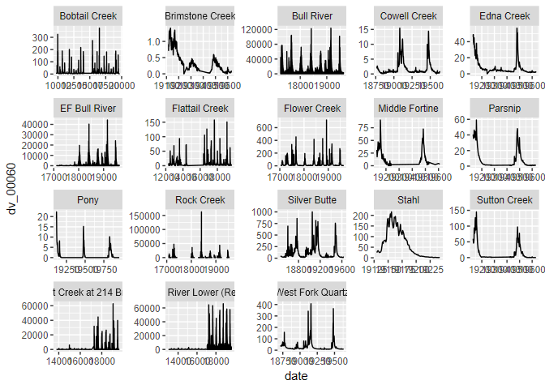

<!-- README.md is generated from README.Rmd. Please edit that file -->

# hydb

<!-- badges: start -->
<!-- badges: end -->

The goal of {hydb} is to provide functions for the cleaning,
manipulating, and testing of hydrological data collected from USDA-USFS
staff and other contributors as well (state, NGO, research). Some of the
functions will be very unique and specific; however, there will be some
basic API functionality for others if they also have sensor/data
cleaning procedures, e.g. transducers, sediment samples, precipitation
cans, etc.

## Installation

You can install the development version of hydb from
[GitHub](https://github.com/) with:

``` r
# install.packages("devtools")
devtools::install_github("joshualerickson/hydb")
```

## About

The hydrological database (hydb) was created to store hydrology data
collected by USDA-USFS staff from sensors/devices (transducers, precip
cans, ISCOs) and observations (discharge, total suspended sediment,
precipitation) across Region 1. Currently the tables available are below
(more to come).

There are several ways to interact with the hydb database:

- The first requires network privileges through the USDA and using the
  `fetch_hydb()` function.

- The second is eventually have this open-source through a database
  online (using `fetch_hydb()`).

## Database Design

The database has two main storage ideas: **metadata** `station_metadata`
and **realizations** (all other tables). The schema is similar to how
most relational databases work where each station has a unique id `sid`
and each parameter (`flow, tss, and precipitation`) has a table based on
how it was collected (`dv` = daily, `iv` = instantaneous, and `obs` =
observed). Below is a conceptual framework of the database.


The API for the realizations is separated by an underscore `_` where the
prefix is the realization `precip_` and the suffix is the collection
type `_obs`, e.g. `precip_obs` would be a table in the database.

``` r
library(hydb)
hydb_tables()
#>  [1] "airtemp_dv"       "airtemp_iv"       "airtemp_obs"      "flow_dv"         
#>  [5] "flow_iv"          "flow_obs"         "param_codes"      "precip_dv"       
#>  [9] "precip_iv"        "precip_obs"       "sarea_obs"        "stage_dv"        
#> [13] "stage_iv"         "stage_obs"        "stat_codes"       "station_metadata"
#> [17] "svel_obs"         "swidth_obs"       "tss_dv"           "tss_iv"          
#> [21] "tss_obs"          "wtemp_dv"         "wtemp_iv"         "wtemp_obs"
```

## Data

When interacting with the database there are some key things to know
about the tables. Each parameter has a code associated with it and
follows the USGS naming conventions.

- `precip_*` contains a continuous variable (`00045`) of precipitation
  in inches.  
- `flow_*` contains a continuous variable (`00060`) of discharge in
  cubic feet/second (cfs).
- `tss_*` contains a continuous variable (`70288`) of total suspended
  sediment (tss) in mg/l.  
- `stage_*` contains a continuous variable (`00065`) of stage in
  inches.  
- `wtemp_*` contains a continuous variable (`00011`) of water
  temperature in Fahrenheit.  
- `airtemp_*` contains a continuous variable (`00021`) of air
  temperature in Fahrenheit.

In addition, the particular collection type has different definitions.

- `iv` is an *instantaneous value*. Meaning, the value is collected
  multiple times a day without being aggregated. For example, transducer
  or precipitation sensors will have multiple readings in one day. This
  would be appropriate to put in the `_iv` database table.

- `dv` is a mean *daily value*. This is data aggregated with `_iv` data.
  For example, aggregating multiple transducer readings to one day by
  mean would be appropriate for the `_dv` database table.

- `obs` is an *observed value*. This is collected by a human (discharge,
  precipitation, tss grab) and then used to interpolate measurements
  when not observed via sensors (in most cases). For example, taking a
  discharge measurement at a site would be an observation of discharge.
  Or, a sample of water would be an observation.

## Interacting with hydb

Interacting with the database can involve a couple different methods:
the {hydb} package `fetch_hydb()` function, or using the {DBI} and
{RSQLite} packages. Either way is completely fine! So if you are
familiar with {DBI} and {RSQLite} then go ahead and use it like you
normally would. The `fetch_hydb()` function just abstracts away some
other functions and is also used for integrating into a Shiny
application.

### Example

Here is a short example of the two different ways to interact.

**{hydb}**

``` r
library(hydb)
library(dplyr)
#> 
#> Attaching package: 'dplyr'
#> The following objects are masked from 'package:stats':
#> 
#>     filter, lag
#> The following objects are masked from 'package:base':
#> 
#>     intersect, setdiff, setequal, union

# get the metadata
meta_data <- fetch_hydb(table = 'station_metadata') %>% 
                    dplyr::filter(forest == 'Kootenai National Forest') %>% 
                    dplyr::collect()

head(meta_data)
#> # A tibble: 6 × 10
#>   station_nm      Long   Lat COMID sid   region forest district comments purpose
#>   <chr>          <dbl> <dbl> <chr> <chr> <chr>  <chr>  <chr>    <chr>    <chr>  
#> 1 Big Creek      -115.  48.8 2287… 0114… North… Koote… Ksanka … <NA>     <NA>   
#> 2 Brimstone Cre… -115.  48.7 2287… 0114… North… Koote… Ksanka … <NA>     <NA>   
#> 3 Deep Creek     -115.  48.8 2287… 0114… North… Koote… Ksanka … <NA>     <NA>   
#> 4 Dodge Creek    -115.  48.9 2287… 0114… North… Koote… Ksanka … <NA>     <NA>   
#> 5 Edna Creek     -115.  48.7 2287… 0114… North… Koote… Ksanka … <NA>     <NA>   
#> 6 Grave Creek    -115.  48.8 2287… 0114… North… Koote… Ksanka … <NA>     <NA>

# now just get flow_dv sites on the Kootenai National Forest
flow_kootenai_dv <- fetch_hydb(table = 'flow_dv', tbl_only = T) %>% 
                    dplyr::filter(sid %in% meta_data$sid) %>% 
                    dplyr::collect()

head(flow_kootenai_dv)
#> # A tibble: 6 × 5
#>    date dv_00060 sid         type  statistic_type_code
#>   <dbl>    <dbl> <chr>       <chr> <chr>              
#> 1 19117    19.1  01140129657 <NA>  00003              
#> 2 19118    22.3  01140129657 <NA>  00003              
#> 3 19119    19.1  01140129657 <NA>  00003              
#> 4 19120    14.1  01140129657 <NA>  00003              
#> 5 19121    11.0  01140129657 <NA>  00003              
#> 6 19122     8.92 01140129657 <NA>  00003

library(ggplot2)

flow_kootenai_dv %>% 
  left_join(meta_data, by = 'sid') %>% 
  ggplot(aes(date, dv_00060)) + 
  geom_line() + 
  facet_wrap(~station_nm, scales = 'free')
```



**{DBI} & {RSQLite}**

``` r
library(DBI)
library(RSQLite)

# get the metadata

mydb <- hydb::hydb_connect()

metadata <- dplyr::collect(tbl(mydb, 'station_metadata'))

head(metadata)
#> # A tibble: 6 × 10
#>   station_nm      Long   Lat COMID sid   region forest district comments purpose
#>   <chr>          <dbl> <dbl> <chr> <chr> <chr>  <chr>  <chr>    <chr>    <chr>  
#> 1 Big Creek      -115.  48.8 2287… 0114… North… Koote… Ksanka … <NA>     <NA>   
#> 2 Brimstone Cre… -115.  48.7 2287… 0114… North… Koote… Ksanka … <NA>     <NA>   
#> 3 Deep Creek     -115.  48.8 2287… 0114… North… Koote… Ksanka … <NA>     <NA>   
#> 4 Dodge Creek    -115.  48.9 2287… 0114… North… Koote… Ksanka … <NA>     <NA>   
#> 5 Edna Creek     -115.  48.7 2287… 0114… North… Koote… Ksanka … <NA>     <NA>   
#> 6 Grave Creek    -115.  48.8 2287… 0114… North… Koote… Ksanka … <NA>     <NA>
# now just get flow_dv sites on the Kootenai National Forest
    
fetch_table = dplyr::collect(tbl(mydb, 'flow_dv'))               
                           
flow_kootenai <- fetch_table %>%
                 dplyr::filter(sid %in% meta_data[meta_data$forest == 'Kootenai' & meta_data$district == 'Ksanka',]$sid )

head(flow_kootenai)
#> # A tibble: 0 × 5
#> # ℹ 5 variables: date <dbl>, dv_00060 <dbl>, sid <chr>, type <chr>,
#> #   statistic_type_code <chr>
```

## Contributing

Contributions are welcome! Feel free to file an issue or create a pull
request (PR). Please read through the contributions guide for more
details on this process.
